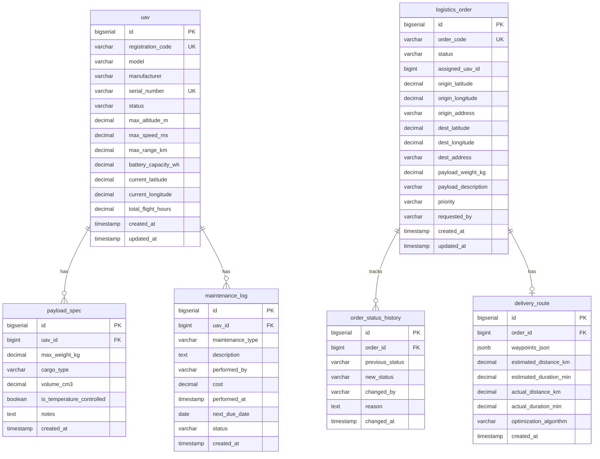

# ERD Planning — Database Schema Design

## UAS Fleet Management ERP

> [!NOTE]
> Dokumen ini berisi rancangan tabel database untuk **fleet_db** dan **order_db**.
> Harap ditinjau sebelum implementasi JPA Entity Class dimulai.

---

## fleet_db — UAV Fleet Master Data

### Tabel: `uav`

Menyimpan data master pesawat tanpa awak (Unmanned Aerial Vehicle).

| Column                | Type            | Constraints                | Description                                                        |
| --------------------- | --------------- | -------------------------- | ------------------------------------------------------------------ |
| `id`                  | `BIGSERIAL`     | PK                         | Auto-increment primary key                                         |
| `registration_code`   | `VARCHAR(50)`   | UNIQUE, NOT NULL           | Kode registrasi unik UAV (e.g., `UAV-2026-001`)                    |
| `model`               | `VARCHAR(100)`  | NOT NULL                   | Model/tipe UAV (e.g., `DJI Matrice 350 RTK`)                       |
| `manufacturer`        | `VARCHAR(100)`  | NOT NULL                   | Pabrikan UAV                                                       |
| `serial_number`       | `VARCHAR(100)`  | UNIQUE, NOT NULL           | Nomor seri pabrik                                                  |
| `status`              | `VARCHAR(20)`   | NOT NULL, DEFAULT `'IDLE'` | Status operasional: `IDLE`, `IN_MISSION`, `MAINTENANCE`, `RETIRED` |
| `max_altitude_m`      | `DECIMAL(8,2)`  |                            | Batas ketinggian maksimum (meter)                                  |
| `max_speed_ms`        | `DECIMAL(6,2)`  |                            | Kecepatan maksimum (m/s)                                           |
| `max_range_km`        | `DECIMAL(8,2)`  |                            | Jangkauan penerbangan maksimum (km)                                |
| `battery_capacity_wh` | `DECIMAL(8,2)`  |                            | Kapasitas baterai (Watt-hour)                                      |
| `current_latitude`    | `DECIMAL(10,7)` |                            | Posisi terakhir — latitude                                         |
| `current_longitude`   | `DECIMAL(10,7)` |                            | Posisi terakhir — longitude                                        |
| `total_flight_hours`  | `DECIMAL(10,2)` | DEFAULT `0`                | Akumulasi jam terbang                                              |
| `created_at`          | `TIMESTAMP`     | NOT NULL, DEFAULT `NOW()`  | Tanggal pendaftaran UAV                                            |
| `updated_at`          | `TIMESTAMP`     | NOT NULL, DEFAULT `NOW()`  | Terakhir diperbarui                                                |

---

### Tabel: `payload_spec`

Spesifikasi muatan yang dapat dibawa oleh setiap UAV.

| Column                      | Type            | Constraints               | Description                                                 |
| --------------------------- | --------------- | ------------------------- | ----------------------------------------------------------- |
| `id`                        | `BIGSERIAL`     | PK                        | Auto-increment primary key                                  |
| `uav_id`                    | `BIGINT`        | FK → `uav.id`, NOT NULL   | Referensi ke UAV pemilik                                    |
| `max_weight_kg`             | `DECIMAL(6,2)`  | NOT NULL                  | Berat muatan maksimum (kg)                                  |
| `cargo_type`                | `VARCHAR(50)`   | NOT NULL                  | Jenis kargo: `PARCEL`, `MEDICAL`, `FOOD`, `HAZMAT`, `OTHER` |
| `volume_cm3`                | `DECIMAL(10,2)` |                           | Volume kompartemen kargo (cm³)                              |
| `is_temperature_controlled` | `BOOLEAN`       | DEFAULT `FALSE`           | Apakah mendukung pengaturan suhu                            |
| `notes`                     | `TEXT`          |                           | Catatan tambahan spesifikasi                                |
| `created_at`                | `TIMESTAMP`     | NOT NULL, DEFAULT `NOW()` | Tanggal dibuat                                              |

**Relationship:** `uav` 1 ←→ N `payload_spec` (satu UAV bisa punya beberapa konfigurasi payload)

---

### Tabel: `maintenance_log`

Catatan pemeliharaan dan perbaikan UAV.

| Column             | Type            | Constraints                     | Description                                              |
| ------------------ | --------------- | ------------------------------- | -------------------------------------------------------- |
| `id`               | `BIGSERIAL`     | PK                              | Auto-increment primary key                               |
| `uav_id`           | `BIGINT`        | FK → `uav.id`, NOT NULL         | Referensi ke UAV yang di-maintain                        |
| `maintenance_type` | `VARCHAR(30)`   | NOT NULL                        | Tipe: `SCHEDULED`, `UNSCHEDULED`, `REPAIR`, `INSPECTION` |
| `description`      | `TEXT`          | NOT NULL                        | Deskripsi pekerjaan pemeliharaan                         |
| `performed_by`     | `VARCHAR(100)`  |                                 | Nama teknisi yang melaksanakan                           |
| `cost`             | `DECIMAL(12,2)` |                                 | Biaya pemeliharaan (IDR)                                 |
| `performed_at`     | `TIMESTAMP`     | NOT NULL                        | Tanggal pelaksanaan pemeliharaan                         |
| `next_due_date`    | `DATE`          |                                 | Jadwal pemeliharaan berikutnya                           |
| `status`           | `VARCHAR(20)`   | NOT NULL, DEFAULT `'COMPLETED'` | Status: `COMPLETED`, `IN_PROGRESS`, `CANCELLED`          |
| `created_at`       | `TIMESTAMP`     | NOT NULL, DEFAULT `NOW()`       | Tanggal record dibuat                                    |

**Relationship:** `uav` 1 ←→ N `maintenance_log`

---

## order_db — Logistics Order Management

### Tabel: `logistics_order`

Tabel utama transaksi order pengiriman logistik.

| Column                | Type            | Constraints                   | Description                                                                      |
| --------------------- | --------------- | ----------------------------- | -------------------------------------------------------------------------------- |
| `id`                  | `BIGSERIAL`     | PK                            | Auto-increment primary key                                                       |
| `order_code`          | `VARCHAR(50)`   | UNIQUE, NOT NULL              | Kode order unik (e.g., `ORD-20260704-0001`)                                      |
| `status`              | `VARCHAR(20)`   | NOT NULL, DEFAULT `'PENDING'` | Lifecycle: `PENDING`, `ROUTED`, `IN_TRANSIT`, `DELIVERED`, `CANCELLED`, `FAILED` |
| `assigned_uav_id`     | `BIGINT`        |                               | ID UAV yang ditugaskan (referensi logis ke `fleet_db.uav.id`)                    |
| `origin_latitude`     | `DECIMAL(10,7)` | NOT NULL                      | Koordinat asal — latitude                                                        |
| `origin_longitude`    | `DECIMAL(10,7)` | NOT NULL                      | Koordinat asal — longitude                                                       |
| `origin_address`      | `VARCHAR(255)`  |                               | Alamat asal (opsional, untuk display)                                            |
| `dest_latitude`       | `DECIMAL(10,7)` | NOT NULL                      | Koordinat tujuan — latitude                                                      |
| `dest_longitude`      | `DECIMAL(10,7)` | NOT NULL                      | Koordinat tujuan — longitude                                                     |
| `dest_address`        | `VARCHAR(255)`  |                               | Alamat tujuan (opsional, untuk display)                                          |
| `payload_weight_kg`   | `DECIMAL(6,2)`  | NOT NULL                      | Berat muatan kiriman (kg)                                                        |
| `payload_description` | `VARCHAR(255)`  |                               | Deskripsi isi kiriman                                                            |
| `priority`            | `VARCHAR(10)`   | DEFAULT `'NORMAL'`            | Prioritas: `LOW`, `NORMAL`, `HIGH`, `URGENT`                                     |
| `requested_by`        | `VARCHAR(100)`  |                               | Nama pengirim/pemohon                                                            |
| `created_at`          | `TIMESTAMP`     | NOT NULL, DEFAULT `NOW()`     | Tanggal order dibuat                                                             |
| `updated_at`          | `TIMESTAMP`     | NOT NULL, DEFAULT `NOW()`     | Terakhir diperbarui                                                              |

---

### Tabel: `order_status_history`

Audit trail setiap perubahan status order (state machine log).

| Column            | Type           | Constraints                         | Description                                |
| ----------------- | -------------- | ----------------------------------- | ------------------------------------------ |
| `id`              | `BIGSERIAL`    | PK                                  | Auto-increment primary key                 |
| `order_id`        | `BIGINT`       | FK → `logistics_order.id`, NOT NULL | Referensi ke order                         |
| `previous_status` | `VARCHAR(20)`  |                                     | Status sebelumnya (NULL untuk status awal) |
| `new_status`      | `VARCHAR(20)`  | NOT NULL                            | Status baru setelah transisi               |
| `changed_by`      | `VARCHAR(100)` |                                     | Siapa/sistem apa yang mengubah status      |
| `reason`          | `TEXT`         |                                     | Alasan perubahan status                    |
| `changed_at`      | `TIMESTAMP`    | NOT NULL, DEFAULT `NOW()`           | Waktu perubahan status                     |

**Relationship:** `logistics_order` 1 ←→ N `order_status_history`

---

### Tabel: `delivery_route`

Rute pengiriman hasil optimasi dari dispatch-engine.

| Column                   | Type           | Constraints                                 | Description                                               |
| ------------------------ | -------------- | ------------------------------------------- | --------------------------------------------------------- |
| `id`                     | `BIGSERIAL`    | PK                                          | Auto-increment primary key                                |
| `order_id`               | `BIGINT`       | FK → `logistics_order.id`, UNIQUE, NOT NULL | Satu order = satu rute                                    |
| `waypoints_json`         | `JSONB`        | NOT NULL                                    | Array waypoint `[{lat, lng, alt}, ...]` dalam format JSON |
| `estimated_distance_km`  | `DECIMAL(8,2)` |                                             | Estimasi jarak total (km)                                 |
| `estimated_duration_min` | `DECIMAL(8,2)` |                                             | Estimasi durasi penerbangan (menit)                       |
| `actual_distance_km`     | `DECIMAL(8,2)` |                                             | Jarak aktual setelah misi selesai                         |
| `actual_duration_min`    | `DECIMAL(8,2)` |                                             | Durasi aktual setelah misi selesai                        |
| `optimization_algorithm` | `VARCHAR(50)`  | DEFAULT `'VRP_ORTOOLS'`                     | Algoritma yang digunakan                                  |
| `created_at`             | `TIMESTAMP`    | NOT NULL, DEFAULT `NOW()`                   | Tanggal rute dibuat                                       |

**Relationship:** `logistics_order` 1 ←→ 1 `delivery_route`

---

## Entity Relationship Diagram

---

## Catatan Desain

1. **Cross-Database Reference**: `logistics_order.assigned_uav_id` merujuk secara **logis** ke `fleet_db.uav.id`. Tidak menggunakan foreign key fisik karena berada di database berbeda (Database-per-Service pattern). Validasi dilakukan melalui OpenFeign call ke fleet-service.

2. **JSONB untuk Waypoints**: `delivery_route.waypoints_json` menggunakan tipe PostgreSQL `JSONB` untuk menyimpan array waypoint. Ini lebih fleksibel daripada tabel terpisah karena jumlah waypoint bervariasi dan jarang di-query secara individual.

3. **Audit Trail**: `order_status_history` mewakili event log setiap transisi status. Ini memudahkan debugging, compliance, dan analisis waktu pemrosesan per tahap.

4. **Soft Reference ID**: `assigned_uav_id` sengaja tidak menjadi FK karena fleet_db dan order_db berada di database terpisah. Konsistensi dikelola di application layer.
